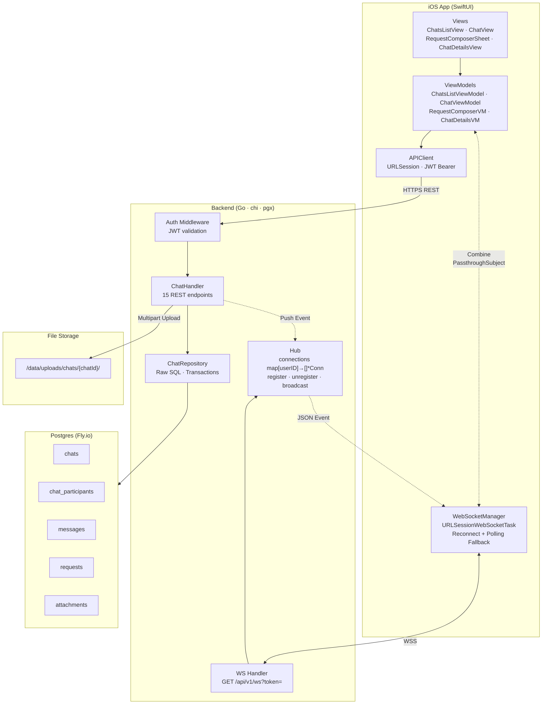
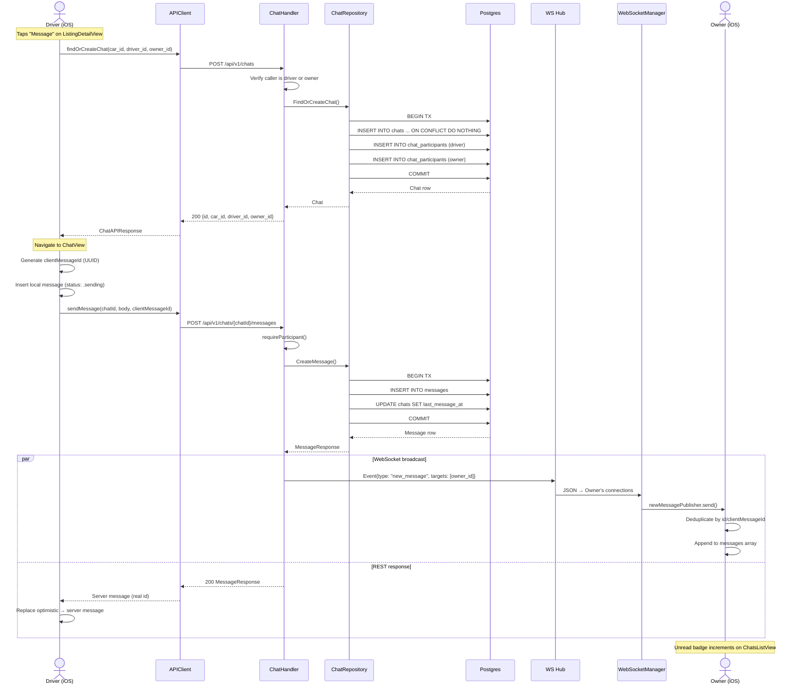
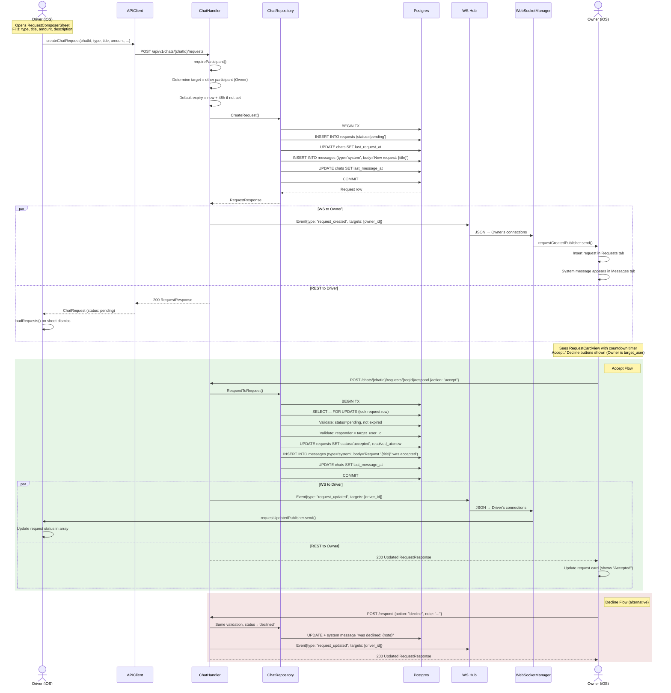
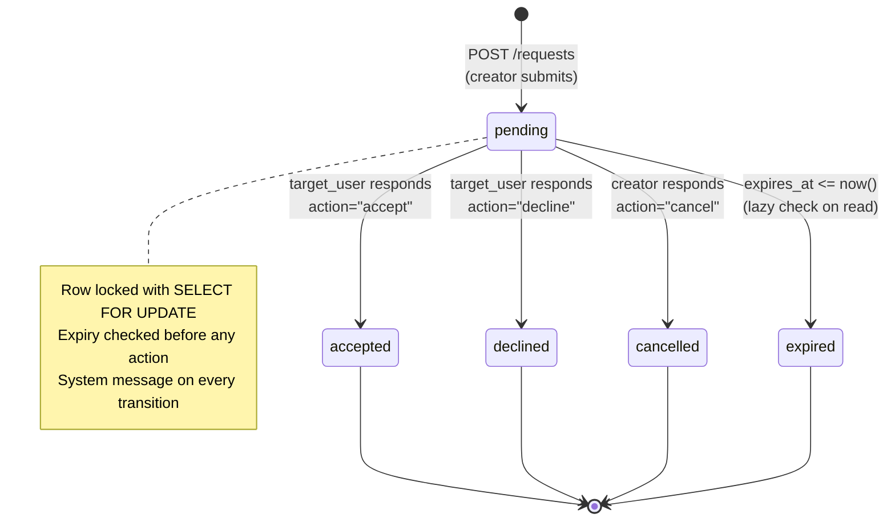
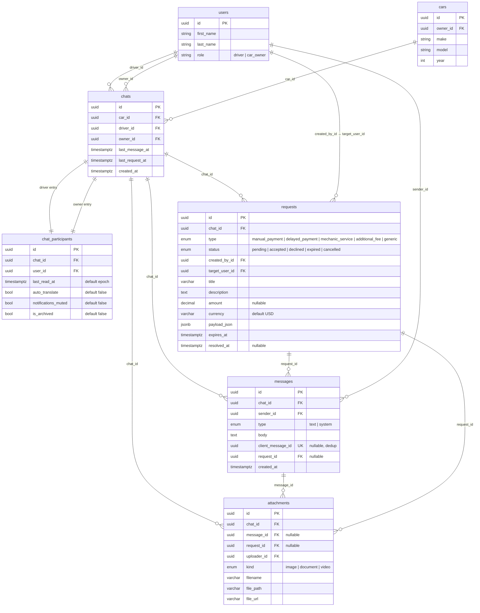
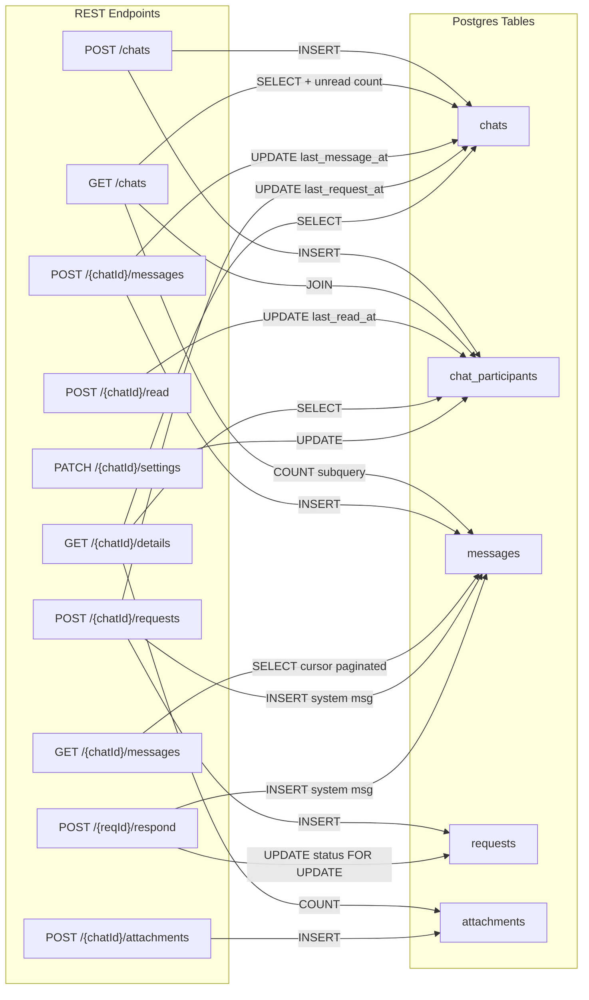
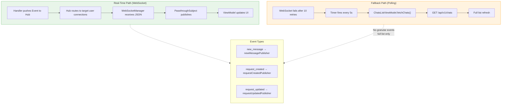

# DrivaBai Chat + Requests System — Architecture Diagrams

---

## 1. High-Level Architecture

---

## 2. Sequence: Create Chat + Send Message

---

## 3. Sequence: Create Request + Accept/Decline

---

## 4. Request State Machine

---

## 5. Data Model

---

## 6. API → Table Mapping

---

## 7. Real-Time vs REST Fallback

---

## Legend

| Symbol | Meaning |
|--------|---------|
| Solid arrow `──>` | Synchronous call / direct dependency |
| Dashed arrow `-.->` | Asynchronous event / push notification |
| `par ... and ...` | Parallel execution (WS broadcast + REST response happen simultaneously) |
| `rect rgb(...)` | Highlighted alternative flow |
| `FK` | Foreign key reference |
| `UK` | Unique constraint (conditional: `WHERE NOT NULL`) |
| `PK` | Primary key |
| Blue subgraph | iOS app layer |
| Green subgraph | Backend server layer |
| Yellow/DB subgraph | Persistence layer |

### Key Design Decisions

| Decision | Rationale |
|----------|-----------|
| **Deterministic chat identity** `UNIQUE(car_id, driver_id, owner_id)` | One chat per car-driver-owner triple; `INSERT ON CONFLICT DO NOTHING` makes FindOrCreate idempotent |
| **Unread = `COUNT(messages WHERE created_at > last_read_at AND sender != me)`** | No separate counter to maintain; always consistent; resets via `UPDATE last_read_at = NOW()` |
| **`client_message_id` for dedup** | Optimistic send on iOS generates UUID before POST; server enforces `UNIQUE WHERE NOT NULL`; prevents double-send on retry |
| **System messages on request transitions** | Every state change (create/accept/decline/cancel/expire) inserts a `type='system'` message; gives full audit trail in message history |
| **WS targets exclude sender** | Sender already has optimistic/REST confirmation; only other participants get push events |
| **Polling fallback after 10 WS retries** | Exponential backoff (1s base) → 5s polling interval; ensures eventual consistency without WS |
| **`SELECT FOR UPDATE` on request respond** | Row-level lock prevents race conditions on concurrent accept/decline |
